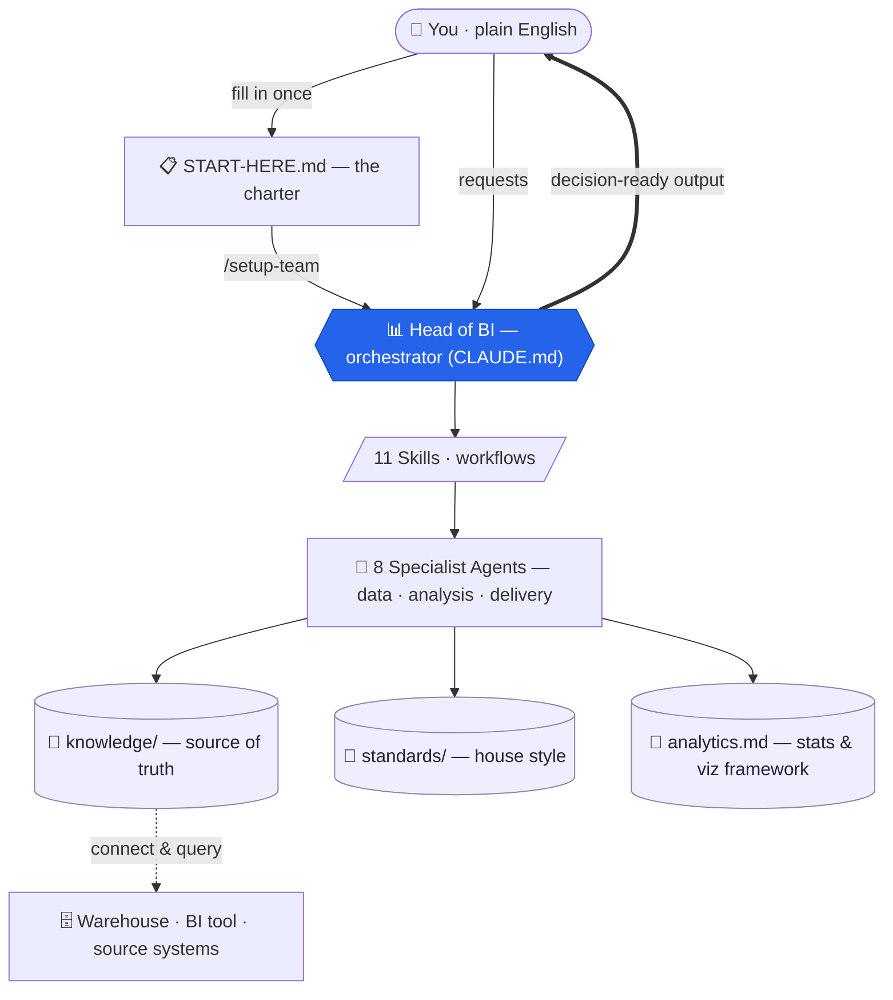
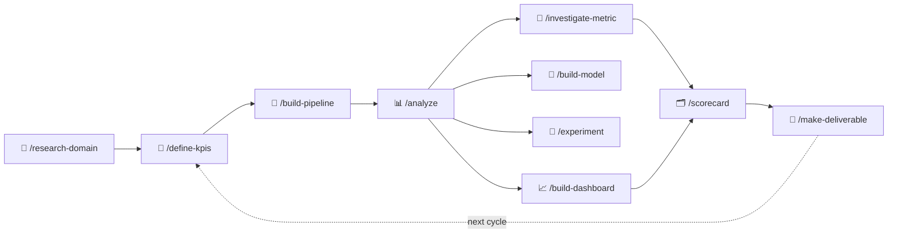

# 📊 Agentic BI Team for Claude Code

> **Created by Colin Beck**
> LinkedIn: https://www.linkedin.com/in/beckcolin/
> GitHub: https://github.com/link7373


**A complete Business Intelligence & Data Analytics team, built from Claude sub-agents and skills.**
Fill in one plain-English charter, run one command, and get a virtual BI function that builds pipelines,
models huge datasets, answers business questions, ships dashboards, defines KPIs, monitors metrics,
forecasts and runs experiments, and produces decision-ready deliverables — grounded in a rigorous
statistical framework and persisted across sessions.


Everything is plain Markdown. No app, no SaaS, no lock-in — the "team" is a set of instruction files that
Claude Code reads.

---

## Why this exists

A real BI team is a group of specialists working a shared operating rhythm: data engineers, analytics
engineers, analysts, dashboard developers, data scientists, a metrics steward, a performance monitor, and
someone who turns analysis into something an executive will act on. This kit recreates that team as
**8 role-based agents** coordinated by a **Head of BI** orchestrator, driven by **11 plain-English
workflows**, and anchored by a **persistent knowledge base** plus a standing **statistical-reasoning
framework** so the numbers are trustworthy and the context survives across sessions.

You talk to it in business English — *"why did signups drop last week?", "build me a board deck on Q2",
"which customers are likely to cancel?", "our events query takes forever"* — and it routes the work to the
right specialist, applies the right method, pressure-tests the result, and returns a decision-ready answer.

What makes this more than a prompt pack: every agent reads `analytics.md` before reporting — a built-in
framework covering distributions (median vs mean), Simpson's paradox, base rates, sampling bias, regression
to the mean, and visualization best practice — so findings survive scrutiny instead of just sounding
confident.

## How it works



**Five moving parts:**

| Part | What it is |
|------|------------|
| 📊 **Orchestrator** (`CLAUDE.md`) | The Head of BI — routes requests, sequences multi-step work, runs the cadence, owns final QA. Auto-loaded every session. |
| 👥 **Agents** (`.claude/agents/`) | 8 specialists, each scoped to a role with deep, role-specific instructions. |
| ⚙️ **Skills** (`.claude/skills/`) | 11 slash-command workflows with step-by-step procedures. |
| 🧠 **Knowledge** (`knowledge/`) | Persistent memory — business context, data sources, the metrics catalog, stakeholders, decisions. The **source of truth**. |
| 📐🧮 **Standards & framework** | House style (`standards/`) and the standing statistical-reasoning + visualization reference (`analytics.md`). |

## The BI job lifecycle

Every workflow chains into the next. A question flows from "what should we measure?" all the way to a
deliverable, and the answers feed back into the next cycle:



## Quick start

> **Prerequisites:** [Claude Code](https://code.claude.com) (CLI, desktop, or web), and some way for it to
> reach your data — a warehouse MCP server, a CLI client (`psql`, `bq`, `snowsql`, `duckdb`, `sqlite3`), or
> just CSV/Parquet files in the repo. Don't worry if that isn't set up yet; `/setup-team` helps you sort it
> out (see [`knowledge/connections.md`](knowledge/connections.md)). Optional: Python 3 for ML and for
> generating `.pptx`/`.docx`/`.xlsx` deliverables (packages installed on demand).

1. **Get the kit** — clone the repo and open it in Claude Code. The `.claude/` folder must be at the root
   of the workspace Claude Code opens.

   ```bash
   git clone https://github.com/link7373/agentic-bi-team.git my-bi-team
   cd my-bi-team
   claude
   ```

   Run `/agents` inside Claude Code to confirm the 8 team members are visible.

2. **Fill out the charter** — open [`START-HERE.md`](START-HERE.md) and answer in plain English. Bullet
   points and brain dumps are fine; no technical vocabulary needed. Leave anything you don't know blank.
   It covers seven areas: the business, your data, metrics & reporting, tools & outputs, advanced
   analytics, rules & boundaries, and context & quirks.

3. **Run setup** — in Claude Code:

   ```
   /setup-team
   ```

   This reads your charter, asks one batched round of clarifying questions, **tests every data connection
   you named** (recording exactly what works and what's blocked), discovers your schemas, replaces every
   `{{placeholder}}` across all files, seeds a draft KPI list for your business model, runs a smoke-test
   that the team is live, and reports back with a suggested first task.

4. **Just ask.** Talk to the Head of BI in business English, or invoke a workflow directly. From here the
   team is live.

## The team — 8 agents

**Data foundation**

| Agent | Owns |
|-------|------|
| `data-engineer` | ETL/ELT pipelines, ingestion from source systems, raw→staging, data-quality gates |
| `analytics-engineer` | Summary/aggregate tables from huge datasets, semantic models, marts, the metric layer |

**Analysis & science**

| Agent | Owns |
|-------|------|
| `bi-analyst` | Ad-hoc analysis, cross-database joins, cohort/funnel/segmentation, deep dives, short reports |
| `data-scientist` | Predictive models, forecasting, segmentation, anomaly models, A/B test design & analysis |

**Governance & monitoring**

| Agent | Owns |
|-------|------|
| `metrics-steward` | KPI/metric definitions, the metrics catalog, the data dictionary, measurement governance |
| `performance-monitor` | Proactive monitoring, weekly/monthly scorecards, anomaly detection, root-cause analysis |

**Delivery**

| Agent | Owns |
|-------|------|
| `dashboard-developer` | Dashboards in Tableau / Power BI / Looker (or self-contained HTML), visual design |
| `insights-communicator` | Exec summaries, decks, docs, workbooks, data storytelling — the last mile |

## The workflows — 11 skills

| Skill | What it does | Lead agent |
|-------|--------------|------------|
| `/setup-team` | Initialize the team from the charter; test connections; seed memory | (orchestrator) |
| `/research-domain` | Learn the product, market, and industry; write dated briefings & benchmarks | bi-analyst |
| `/define-kpis` | Metric tree + rigorous catalog definitions, targets, thresholds, counter-metrics | metrics-steward |
| `/build-pipeline` | Design & build an ETL pipeline or summary table, with quality gates | data-engineer + analytics-engineer |
| `/analyze` | Full business-problem analysis (incl. cross-DB joins), pressure-tested, with `FINDINGS.md` | bi-analyst |
| `/investigate-metric` | Anomaly & root-cause analysis: verify → localise → correlate → test → conclude | performance-monitor + bi-analyst |
| `/build-model` | Scoped ML development (leakage-safe, baseline-first, model card) | data-scientist |
| `/experiment` | Design or read out an A/B test (power analysis, pre-registered metric, SRM, effect size + CI) | data-scientist |
| `/scorecard weekly\|monthly` | The periodic performance scorecard — fixed KPI set, status colours, narrative | performance-monitor + insights-communicator |
| `/build-dashboard` | Spec → data layer → build → number-by-number validation, in the team's BI tool | dashboard-developer + analytics-engineer |
| `/make-deliverable` | Pyramid-structured deck / doc / workbook with every figure source-mapped | insights-communicator |

## Knowledge & memory

The team remembers. Everything lives in `knowledge/` as the single source of truth, and agents are
instructed to **read before a task and write back after**:

- **Context:** `business-context.md` (company, priorities, glossary, change ledger), `stakeholders.md`
  (audiences, preferences, distribution rules)
- **Data:** `data-sources.md` (connections, table inventory, join keys, the data dictionary, landmines),
  `connections.md` (the plain-English setup runbook)
- **Metrics:** `metrics-catalog.md` — **THE** source of truth for every metric definition; no number ships
  unless it's defined here and computed exactly as defined
- **Intelligence:** `industry-notes.md` (dated research briefings & benchmarks)
- **Governance:** `decision-log.md` (methodological rulings & proactively-spotted observations)

Commit the repo regularly — the git history is the team's institutional memory. The `.gitignore` keeps the
reproducible layer (queries, write-ups, specs, scripts) in version control and excludes bulk data and
rendered blobs, so every reported number stays traceable without committing sensitive exports.

## The analytics framework

`analytics.md` is the team's standing analytical reference — the thing that makes the output trustworthy:

- **Statistical reasoning (Part 1):** distributions & median-vs-mean, the inspection paradox, Simpson's
  paradox, base-rate fallacy, collider/Berkson bias, heavy tails & disaster risk, regression to the mean,
  age-period-cohort effects, and the fairness-impossibility theorem.
- **Visualization (Part 2):** preattentive attributes, a chart-selection guide, charts to avoid (and why),
  colour & colour-blindness rules, axis honesty, dashboard design principles.
- **Applied rules (Part 3):** a pre-publish statistical-hygiene checklist every number passes before it ships.

It is distilled into `standards/reporting-standards.md` and `standards/dashboard-standards.md`, and every
analytical agent references it by name.

## Standards

House style lives in `standards/`, and the relevant file is read before producing that artifact type:

- **`sql-and-data-standards.md`** — warehouse layering (raw→staging→marts), naming, correctness rules
  (grain, idempotency, point-in-time joins, guarded division), quality gates, cost discipline.
- **`reporting-standards.md`** — pyramid structure, takeaway-sentence titles, anchored comparisons,
  proportionate caveats, the statistical-integrity non-negotiables and hygiene checklist.
- **`dashboard-standards.md`** — Z-pattern layout, the five-second test, chart-selection & charts-to-avoid
  tables, semantic colour, honesty rules, the dead-end-dashboard guard.

## Configuration & integrations

**The placeholder system.** Every file ships with `{{PLACEHOLDERS}}` marking where your configuration goes
(`{{COMPANY_NAME}}`, `{{BI_TOOL}}`, `{{DATA_PRIVACY_RULES}}`, scorecard thresholds, brand colours…).
`/setup-team` fills them from your charter; you can also hand-edit any file at any time (hand edits are
equally authoritative). To find anything still unconfigured:

```bash
grep -rn "{{" --include="*.md" .
```

**Connecting your data.** The team reads connection details from `knowledge/data-sources.md`. Three
patterns, in order of preference — an **MCP server** for your warehouse, a **CLI client** with credentials
in environment variables, or **files** (CSV/Parquet) analysed locally with DuckDB/pandas. `/setup-team`
verifies whichever you have with live test queries; nothing is recorded as "working" untested. The full,
non-technical runbook (including the no-secrets-in-git rule) is [`knowledge/connections.md`](knowledge/connections.md).

**Configuring the BI tool.** Set your tool in the charter (or directly in `CLAUDE.md` and
`dashboard-developer.md`). The dashboard developer carries tool-specific rules for **Tableau**, **Power
BI**, and **Looker**; with no direct API access it produces import-ready artifacts plus setup steps; with
no BI tool at all it builds self-contained HTML dashboards.

**Safety rails.** Two placeholders in `CLAUDE.md` §8 govern autonomy: a **never-without-asking** list
(destructive or outward-facing actions always confirm unless pre-authorised) and a **pre-authorised** list.
Privacy rules propagate into querying, dashboards, and exports, including minimum aggregation sizes.

**Tuning behaviour:**

| Want to change | Edit |
|---|---|
| Routing, operating principles, escalation rules | `CLAUDE.md` |
| What a specific role does | `.claude/agents/<role>.md` |
| The steps of a workflow | `.claude/skills/<name>/SKILL.md` |
| Metric definitions, targets, thresholds | `knowledge/metrics-catalog.md` (or run `/define-kpis`) |
| SQL conventions, naming, quality gates | `standards/sql-and-data-standards.md` |
| Chart / colour / layout rules | `standards/dashboard-standards.md` |
| Report structure, tone, branding | `standards/reporting-standards.md` |
| Who gets what, in which format | `knowledge/stakeholders.md` |

### Running on a schedule

The scorecards and monitoring are designed for recurring runs:
- **Headless CLI:** `claude -p "/scorecard weekly"` from cron or any scheduler.
- **Claude Code web / GitHub Action:** start a session on this repo on a schedule and ask for the scorecard.
- **Manual:** just run `/scorecard weekly` each Monday — one command either way.

## Repository layout

```
agentic-bi-team/
├─ START-HERE.md            # the charter you fill in (plain English)
├─ CLAUDE.md                # Head of BI orchestrator (routing, principles, escalation)
├─ README.md
├─ analytics.md             # statistical-reasoning & visualization framework
├─ LICENSE · .gitignore · .gitattributes
├─ .claude/
│  ├─ agents/               # 8 specialist sub-agents
│  └─ skills/               # 11 slash-command workflows
├─ knowledge/               # persistent memory — source of truth
│  ├─ business-context.md · data-sources.md · connections.md
│  ├─ metrics-catalog.md · stakeholders.md
│  ├─ industry-notes.md · decision-log.md
├─ standards/               # sql-and-data · reporting · dashboard house style
├─ analyses/                # generated: one folder per analysis (queries + FINDINGS.md)
├─ pipelines/ · dashboards/ · experiments/   # generated: each with a README inventory
├─ models/ · scorecards/ · deliverables/     # generated: model cards, scorecards, decks
```

Working directories (`analyses/`, `pipelines/`, `dashboards/`, `models/`, `experiments/`, `scorecards/`,
`deliverables/`) fill in as the team operates; `pipelines/`, `dashboards/`, and `experiments/` ship with a
`README.md` inventory so the "check for existing work" step always has something to read.

## Extending the team

- **Add a team member:** create `.claude/agents/<name>.md` (frontmatter `name`, `description` + role
  instructions) and add a row to the routing table in `CLAUDE.md` §3. Useful additions: a financial
  analyst, a data-governance officer.
- **Add a workflow:** create `.claude/skills/<name>/SKILL.md` (frontmatter + numbered procedure) and list
  it in `CLAUDE.md` §4.
- **Industry packs:** the metrics-steward and `/define-kpis` adapt to your business model from the charter;
  for deep vertical needs, extend `knowledge/metrics-catalog.md` and `industry-notes.md` directly.

## Principles

- **Decision-first** — every piece of work starts from the decision it informs.
- **Knowledge base is law** — `metrics-catalog.md` is the single source of truth; never invent a competing
  definition.
- **Show your work** — every number traces to a query saved in the repo; nothing un-reproducible.
- **Validate before you trust** — profile row counts, dates, duplicates, nulls; apply the `analytics.md`
  framework before reporting.
- **Proactive by default** — flag off-trend metrics, data-quality problems, and opportunities even when
  nobody asked.

## Troubleshooting

| Symptom | Fix |
|---|---|
| Agents/skills don't appear | `.claude/` must be at the root of the folder Claude Code opened. Check with `/agents`. |
| Team asks for context it should know | Placeholders left unfilled — run the `{{` grep above, or re-run `/setup-team`. |
| Two reports disagree on a number | A metrics-steward job: say "these two numbers disagree" and it reproduces both, rules, and fixes the deviating artifact. |
| Data connection broke | Update `knowledge/data-sources.md` (or tell the team — it retests and updates the file). See `connections.md`. |
| Output style isn't right | Edit the relevant `standards/` file once; every future artifact follows it. |

## License & disclaimer

Released under the [MIT License](LICENSE). The kit is instructions, not advice — validate business-critical
numbers and decisions the same way you would coming from any analyst.
