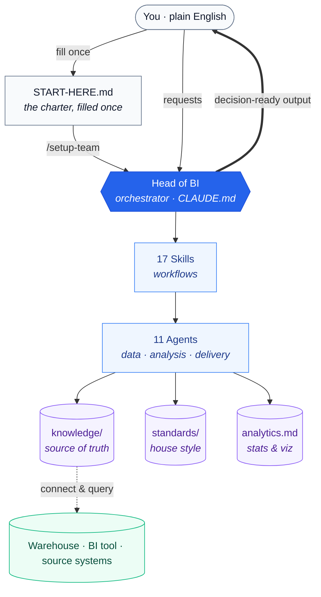
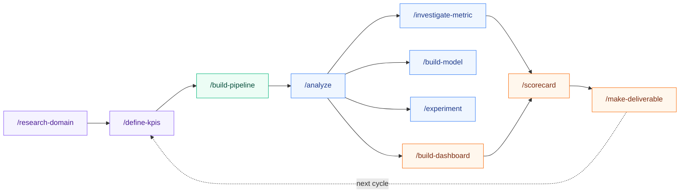
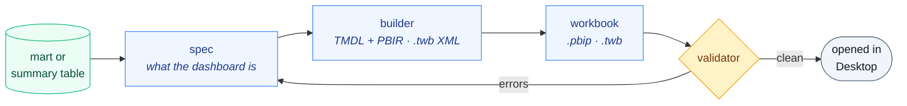

# 📊 Agentic BI Team for Claude Code

> **Created by Colin Beck**
> LinkedIn: https://www.linkedin.com/in/beckcolin/
> GitHub: https://github.com/link7373


**A complete Business Intelligence & Data Analytics team, built from Claude sub-agents and skills.**
Fill in one plain-English charter, run one command, and get a virtual BI function that builds pipelines,
models huge datasets, answers business questions, ships dashboards, defines KPIs, monitors metrics,
forecasts and runs experiments, and produces decision-ready deliverables — grounded in a rigorous
statistical framework and persisted across sessions.


Everything is plain Markdown. No app, no SaaS, no lock-in — the "team" is a set of instruction files that
Claude Code reads.

---

## Why this exists

A real BI team is a group of specialists working a shared operating rhythm: data engineers, analytics
engineers, analysts, dashboard developers, data scientists, a metrics steward, a performance monitor, and
someone who turns analysis into something an executive will act on. This kit recreates that team as
**11 role-based agents** coordinated by a **Head of BI** orchestrator, driven by **17 plain-English
workflows**, and anchored by a **persistent knowledge base** plus a standing **statistical-reasoning
framework** so the numbers are trustworthy and the context survives across sessions.

You talk to it in business English — *"why did signups drop last week?", "build me a board deck on Q2",
"which customers are likely to cancel?", "our events query takes forever"* — and it routes the work to the
right specialist, applies the right method, pressure-tests the result, and returns a decision-ready answer.

What makes this more than a prompt pack: every agent reads `analytics.md` before reporting — a built-in
framework covering distributions (median vs mean), Simpson's paradox, base rates, sampling bias, regression
to the mean, and visualization best practice — so findings survive scrutiny instead of just sounding
confident.

## How it works


```mermaid
flowchart TB
    YOU(["You · plain English"])
    CHARTER["START-HERE.md<br/><i>the charter, filled once</i>"]
    ORCH{{"Head of BI<br/><i>orchestrator · CLAUDE.md</i>"}}
    SKILLS["17 Skills<br/><i>workflows</i>"]
    AGENTS["11 Agents<br/><i>data · analysis · delivery</i>"]
    KN[("knowledge/<br/><i>source of truth</i>")]
    ST[("standards/<br/><i>house style</i>")]
    AR[("analytics.md<br/><i>stats & viz</i>")]
    DATA[("Warehouse · BI tool · source systems")]

    YOU -->|"fill once"| CHARTER
    CHARTER -->|"/setup-team"| ORCH
    YOU -->|"requests"| ORCH
    ORCH --> SKILLS
    SKILLS --> AGENTS
    AGENTS --> KN
    AGENTS --> ST
    AGENTS --> AR
    KN -.->|"connect & query"| DATA
    ORCH ==>|"decision-ready output"| YOU

    classDef actor fill:#F8FAFC,stroke:#64748B,stroke-width:1px,color:#0F172A;
    classDef hub fill:#2563EB,stroke:#1D4ED8,stroke-width:1px,color:#FFFFFF;
    classDef work fill:#EFF6FF,stroke:#3B82F6,stroke-width:1px,color:#1E3A8A;
    classDef store fill:#F5F3FF,stroke:#8B5CF6,stroke-width:1px,color:#4C1D95;
    classDef ext fill:#ECFDF5,stroke:#10B981,stroke-width:1px,color:#064E3B;
    class YOU,CHARTER actor;
    class ORCH hub;
    class SKILLS,AGENTS work;
    class KN,ST,AR store;
    class DATA ext;
```

**Six moving parts:**

| Part | What it is |
|------|------------|
| 📊 **Orchestrator** (`CLAUDE.md`) | The Head of BI — routes requests, sequences multi-step work, runs the cadence, owns final QA. Auto-loaded every session. |
| 👥 **Agents** (`.claude/agents/`) | 11 specialists, each scoped to a role with deep, role-specific instructions. |
| ⚙️ **Skills** (`.claude/skills/`) | 17 slash-command workflows with step-by-step procedures. |
| 🧠 **Knowledge** (`knowledge/`) | Persistent memory — business context, data sources, the metrics catalog, stakeholders, decisions, incidents, requests. The **source of truth**. |
| 📐🧮 **Standards & framework** | House style (`standards/`) and the standing statistical-reasoning + visualization reference (`analytics.md`). |
| 🛡️ **Tooling & rails** (`scripts/`, `.claude/settings.json`) | Standard-library checks the team runs on itself, a least-privilege permission set, and a hook that blocks destructive SQL. |

## The BI job lifecycle

Every workflow chains into the next. A question flows from "what should we measure?" all the way to a
deliverable, and the answers feed back into the next cycle:


```mermaid
flowchart LR
    RD["/research-domain"]
    DK["/define-kpis"]
    BP["/build-pipeline"]
    AN["/analyze"]
    IM["/investigate-metric"]
    BM["/build-model"]
    EX["/experiment"]
    BD["/build-dashboard"]
    SC["/scorecard"]
    MD["/make-deliverable"]

    RD --> DK
    DK --> BP
    BP --> AN
    AN --> IM
    AN --> BM
    AN --> EX
    AN --> BD
    IM --> SC
    BD --> SC
    SC --> MD
    MD -.->|"next cycle"| DK

    classDef define fill:#F5F3FF,stroke:#8B5CF6,stroke-width:1px,color:#4C1D95;
    classDef build fill:#ECFDF5,stroke:#10B981,stroke-width:1px,color:#064E3B;
    classDef analyse fill:#EFF6FF,stroke:#3B82F6,stroke-width:1px,color:#1E3A8A;
    classDef deliver fill:#FFF7ED,stroke:#F97316,stroke-width:1px,color:#7C2D12;
    class RD,DK define;
    class BP build;
    class AN,IM,BM,EX analyse;
    class BD,SC,MD deliver;
```

**Colour reads as phase:** 🟣 define · 🟢 build · 🔵 analyse · 🟠 deliver. Nothing here is a
one-way door — `/analyze` branches to whichever of investigation, modelling, experimentation or
dashboarding the question actually needs, and the scorecard feeds the next cycle's KPI review.

## Quick start

> **Prerequisites:** [Claude Code](https://code.claude.com) (CLI, desktop, or web), and some way for it to
> reach your data — a warehouse MCP server, a CLI client (`psql`, `bq`, `snowsql`, `duckdb`, `sqlite3`), or
> just CSV/Parquet files in the repo. Don't worry if that isn't set up yet; `/setup-team` helps you sort it
> out (see [`knowledge/connections.md`](knowledge/connections.md)). Optional: Python 3 for ML and for
> generating `.pptx`/`.docx`/`.xlsx` deliverables (packages installed on demand).

1. **Get the kit** — clone the repo and open it in Claude Code. The `.claude/` folder must be at the root
   of the workspace Claude Code opens.

   ```bash
   git clone https://github.com/link7373/agentic-bi-team.git my-bi-team
   cd my-bi-team
   claude
   ```

   Run `/agents` inside Claude Code to confirm the team is visible.

2. **Fill out the charter** — open [`START-HERE.md`](START-HERE.md) and answer in plain English. Bullet
   points and brain dumps are fine; no technical vocabulary needed. Leave anything you don't know blank.
   It covers seven areas: the business, your data, metrics & reporting, tools & outputs, advanced
   analytics, rules & boundaries, and context & quirks.

3. **Run setup** — in Claude Code:

   ```
   /setup-team
   ```

   This snapshots every file it's about to touch (so the whole thing is undoable), reads your charter,
   asks one batched round of clarifying questions, shows you the placeholder mapping **before** writing
   anything, **tests every data connection you named** (recording exactly what works and what's blocked),
   discovers your schemas, replaces every `{{placeholder}}`, seeds a draft KPI list for your business
   model, runs `/health-check` to prove the team is live, and reports back with a suggested first task.

4. **Just ask.** Talk to the Head of BI in business English, or invoke a workflow directly. From here the
   team is live.

### Or: see it work in ten minutes, with no warehouse

No data connected yet, or just evaluating? Run `/setup-team` and choose **demo mode**. It builds a
fictional B2B SaaS warehouse in SQLite — 50,000 rows, two years, standard library only, no installs —
and configures the whole team against it:

```bash
python demo/generate_demo_data.py
```

Then try `/scorecard weekly`, and `/investigate-metric churn`. **Three findings are deliberately planted
in the data**: a churn spike concentrated in one segment that the blended number hides, two data-quality
defects (a nine-day pipeline outage and a month of duplicate invoices), and seasonality that makes a
month-over-month comparison lie. Seeing whether the team finds them — and whether it says which one is a
data problem *before* treating it as a business result — tells you more than any feature list.

## The team — 11 agents

**Data foundation**

| Agent | Owns |
|-------|------|
| `data-engineer` | ETL/ELT pipelines, ingestion from source systems, raw→staging, in-pipeline quality gates |
| `analytics-engineer` | Summary/aggregate tables from huge datasets, semantic models, marts, the metric layer |
| `data-quality-engineer` | Data health: freshness SLAs, volume & schema drift, profiling, reconciliation, data incidents |

**Analysis & science**

| Agent | Owns |
|-------|------|
| `bi-analyst` | Ad-hoc analysis, cross-database joins, cohort/funnel/segmentation, deep dives, short reports |
| `data-scientist` | Predictive models, forecasting, segmentation, anomaly models, A/B test design & analysis |

**Governance & monitoring**

| Agent | Owns |
|-------|------|
| `metrics-steward` | KPI/metric definitions, the metrics catalog, the data dictionary, measurement governance |
| `performance-monitor` | Proactive monitoring, weekly/monthly scorecards, anomaly detection, root-cause analysis |

**Delivery**

| Agent | Owns |
|-------|------|
| `dashboard-developer` | Dashboards in Tableau / Power BI / Looker (or self-contained HTML), visual design |
| `insights-communicator` | Exec summaries, decks, docs, workbooks, data storytelling — the last mile |
| `powerbi-validator` | PBIP structure, TMDL/PBIR schemas, naming, field references — Power BI teams only |
| `tableau-validator` | `.twb` schema conformance, field & sheet references, extract wiring — Tableau teams only |

**Why `data-quality-engineer` is its own role, not a bullet in `data-engineer`.** When revenue drops 40%,
`performance-monitor` asks "what happened to sales?" and `data-quality-engineer` asks "did the invoice
pipeline run?" — and it answers first, because roughly half of all "the metric crashed" alerts turn out to
be a stale table or a schema change. Every hour of business analysis spent before that check is wasted.
It's a different question, a different method, and a different first move.

## The workflows — 17 skills

| Skill | What it does | Lead agent |
|-------|--------------|------------|
| `/setup-team` | Initialize the team from the charter; test connections; seed memory | (orchestrator) |
| `/connect-data` | Connect one source and **prove** it works with a live query | (orchestrator) |
| `/health-check` | Self-audit: repo lint, placeholders, metric catalog, connections, staleness, drift | data-quality-engineer |
| `/triage` | Classify, size, route, and log an incoming request — the front door | (orchestrator) |
| `/research-domain` | Learn the product, market, and industry; write dated briefings & benchmarks | bi-analyst |
| `/define-kpis` | Metric tree + rigorous catalog definitions, targets, thresholds, counter-metrics | metrics-steward |
| `/build-pipeline` | Design & build an ETL pipeline or summary table, with quality gates | data-engineer + analytics-engineer |
| `/analyze` | Full business-problem analysis (incl. cross-DB joins), pressure-tested, with `FINDINGS.md` | bi-analyst |
| `/investigate-metric` | Anomaly & root-cause analysis: verify → localise → correlate → test → conclude | performance-monitor + bi-analyst |
| `/build-model` | Scoped ML development (leakage-safe, baseline-first, model card) | data-scientist |
| `/experiment` | Design or read out an A/B test (power analysis, pre-registered metric, SRM, effect size + CI) | data-scientist |
| `/scorecard weekly\|monthly` | The periodic performance scorecard — fixed KPI set, status colours, narrative | performance-monitor + insights-communicator |
| `/build-dashboard` | Spec → data layer → build → number-by-number validation, in the team's BI tool | dashboard-developer + analytics-engineer |
| `/powerbi` | Power BI only: PBIP project as code — TMDL model, PBIR report, theme, validation gate | dashboard-developer + powerbi-validator |
| `/tableau` | Tableau only: `.twb` workbook as code — spec-driven sheets, extract, validation gate | dashboard-developer + tableau-validator |
| `/make-deliverable` | Pyramid-structured deck / doc / workbook with every figure source-mapped | insights-communicator |
| `/upgrade` | Pull a newer release's framework changes without touching your knowledge base | (orchestrator) |

## Dashboards as code

For most BI tools the team produces the artifact and the setup steps, and a human does the
import. **Power BI and Tableau are the exceptions** — both store a dashboard as plain text,
so the team builds, edits and validates the real thing, and it version-controls like any
other work product.


```mermaid
flowchart LR
    MART[("mart or<br/>summary table")]
    SPEC["spec<br/><i>what the dashboard is</i>"]
    BUILD["builder<br/><i>TMDL + PBIR · .twb XML</i>"]
    ART["workbook<br/><i>.pbip · .twb</i>"]
    VAL{"validator"}
    OPEN(["opened in<br/>Desktop"])

    MART --> SPEC
    SPEC --> BUILD
    BUILD --> ART
    ART --> VAL
    VAL -->|"errors"| SPEC
    VAL -->|"clean"| OPEN

    classDef src fill:#ECFDF5,stroke:#10B981,color:#064E3B;
    classDef step fill:#EFF6FF,stroke:#3B82F6,color:#1E3A8A;
    classDef gate fill:#FEF3C7,stroke:#F59E0B,color:#78350F;
    classDef out fill:#F1F5F9,stroke:#64748B,color:#0F172A;
    class MART src;
    class SPEC,BUILD,ART step;
    class VAL gate;
    class OPEN out;
```

The spec is the source and the workbook is its output, so a dashboard is reproducible from
the mart rather than being a binary somebody once saved.

### Power BI — PBIP

Set `{{BI_TOOL}}` to Power BI and `/build-dashboard` hands implementation to
[`/powerbi`](.claude/skills/powerbi/SKILL.md), which authors the star-schema model in TMDL,
pages and visuals in PBIR, and a theme that encodes the design standards once instead of
per-visual.

`validate_pbip.py` (standard library, no installs) runs ~35 checks and catches the failures
Power BI Desktop *doesn't report*:

- a page folder named `My Page` — Desktop silently ignores it and the page vanishes
- schema versions left at `1.0.0` — the model loads, zero pages render, no error
- a UTF-8 BOM in the gitignored `.pbi/localSettings.json` — invisible in git, fatal on open
- a theme registered in `themeCollection` but not `resourcePackages` — silently no theme
- a measure bound to a table that no longer exists

Every one was found by opening a real project in Desktop *after* the validator said clean.
They're now regression tests: `python .claude/skills/powerbi/tests/run_tests.py` builds a
working PBIP plus 16 injected defects and asserts each raises its specific code.

### Tableau — `.twb`

Set `{{BI_TOOL}}` to Tableau and [`/tableau`](.claude/skills/tableau/SKILL.md) builds the
workbook from a compact spec — six tested chart recipes, CSV or live-SQL connections,
`.hyper` extracts and `.twbx` packaging where the target needs them. A single worksheet is
150–250 lines of order-sensitive XML; the builder owns that, so the spec stays about thirty.

**The catch worth knowing about:** Tableau's *published* XSD is not the schema Tableau
applies when it opens a file. The real one is a template resolved at load time from feature
flags the workbook itself declares, so a file can pass the official schema and still refuse
to open. `extract_runtime_schema.py` resolves the real schema from a local Tableau install,
and `validate_twb.py` prefers it — warning explicitly when it has to fall back.

Its semantic checks exist because real workbooks failed:

- an unqualified field reference — Tableau drops the field and the sheet renders nothing
- a dashboard with no `<viewpoint>` for a sheet it shows — Tableau refuses the whole dashboard
- a shelf pointing at a column no longer declared on the datasource
- CSV header drift against the declared fields

All of those are invisible to schema validation. They're regression tests too, built by
mutating a known-good fixture: `python .claude/skills/tableau/tests/run_tests.py`
(29 assertions). A worked example ships in
[`examples/demo-exec-overview/`](.claude/skills/tableau/examples/demo-exec-overview/),
built from the demo warehouse and verified open in Tableau Public.

### Both, the same way

Capability degrades gracefully — the default tier needs only the desktop app and Python, and
is enough to build a complete dashboard. Optional accelerators are detected if you've
installed them, never bundled, and licence restrictions are surfaced *before* anything is
suggested.

**Neither loads for teams on another tool.** Each skill checks `{{BI_TOOL}}` and bows out,
and all the vendor depth sits in reference files read only when that tool's step runs.

## Knowledge & memory

The team remembers. Everything lives in `knowledge/` as the single source of truth, and agents are
instructed to **read before a task and write back after**:

- **Context:** `business-context.md` (company, priorities, glossary, change ledger), `stakeholders.md`
  (audiences, preferences, distribution rules)
- **Data:** `data-sources.md` (connections, table inventory, join keys, the data dictionary, landmines),
  `connections.md` (the plain-English setup runbook)
- **Metrics:** `metrics-catalog.md` — **THE** source of truth for every metric definition; no number ships
  unless it's defined here and computed exactly as defined
- **Intelligence:** `industry-notes.md` (dated research briefings & benchmarks)
- **Governance:** `decision-log.md` (methodological rulings & proactively-spotted observations)
- **Operations:** `data-quality-log.md` (data incidents and the checks that came out of them),
  `incident-runbook.md` (what to do when the data is wrong, decided before you need it),
  `request-log.md` (what the team was asked, what it delivered, and what was never used)

The metrics catalog is both readable and checkable: each entry carries a fenced YAML block (name,
definition, grain, owner, SQL), so `scripts/check_metrics.py` can prove that every number on a scorecard
has a definition behind it and that no metric is defined twice. "Computed in exactly one place" stops
being a rule everyone agrees with and starts being one that fails CI.

Commit the repo regularly — the git history is the team's institutional memory. The `.gitignore` keeps the
reproducible layer (queries, write-ups, specs, scripts) in version control and excludes bulk data and
rendered blobs, so every reported number stays traceable without committing sensitive exports.

## The analytics framework

`analytics.md` is the team's standing analytical reference — the thing that makes the output trustworthy:

- **Statistical reasoning (Part 1):** distributions & median-vs-mean, the inspection paradox, Simpson's
  paradox, base-rate fallacy, collider/Berkson bias, heavy tails & disaster risk, regression to the mean,
  age-period-cohort effects, and the fairness-impossibility theorem.
- **Visualization (Part 2):** preattentive attributes, a chart-selection guide, charts to avoid (and why),
  colour & colour-blindness rules, axis honesty, dashboard design principles.
- **Applied rules (Part 3):** a pre-publish statistical-hygiene checklist every number passes before it ships.

It is distilled into `standards/reporting-standards.md` and `standards/dashboard-standards.md`, and every
analytical agent references it by name.

## Standards

House style lives in `standards/`, and the relevant file is read before producing that artifact type:

- **`sql-and-data-standards.md`** — warehouse layering (raw→staging→marts), naming, correctness rules
  (grain, idempotency, point-in-time joins, guarded division), quality gates, cost discipline.
- **`reporting-standards.md`** — pyramid structure, takeaway-sentence titles, anchored comparisons,
  proportionate caveats, the statistical-integrity non-negotiables and hygiene checklist.
- **`dashboard-standards.md`** — Z-pattern layout, the five-second test, chart-selection & charts-to-avoid
  tables, semantic colour, honesty rules, the dead-end-dashboard guard.
- **`data-modeling-standards.md`** — facts & dimensions, grain, surrogate keys, slowly-changing dimensions.
- **`tableau-standards.md`** — *Tableau teams only.* One grain per workbook, marts not workbook
  logic, extracts over live connections, calculated fields for presentation only, the LOD filter
  trap, the validation gate. Defers to `dashboard-standards.md` for every design decision.
- **`powerbi-standards.md`** — *Power BI teams only.* Star schema, one date table, catalog-exact measure
  names, thin DAX, theme-first formatting, the naming rule, the validation gate. Defers to
  `dashboard-standards.md` for every design decision, so there's still one source of truth for chart
  choice and colour.

## Configuration & integrations

**The placeholder system.** Every file ships with `{{PLACEHOLDERS}}` marking where your configuration goes
(`{{COMPANY_NAME}}`, `{{BI_TOOL}}`, `{{DATA_PRIVACY_RULES}}`, scorecard thresholds, brand colours…).
`/setup-team` fills them from your charter; you can also hand-edit any file at any time (hand edits are
equally authoritative). Two forms, and the distinction is enforced: `{{UPPER_SNAKE}}` is filled by setup
and must be gone afterwards, while `{{lowercase prose}}` is a blank you fill per entry when you write a
log entry or a metric definition. To see the whole inventory, or check nothing was missed:

```bash
python scripts/check_placeholders.py --list
```

**Connecting your data.** The team reads connection details from `knowledge/data-sources.md`. Three
patterns, in order of preference — an **MCP server** for your warehouse, a **CLI client** with credentials
in environment variables, or **files** (CSV/Parquet) analysed locally. Run
[`/connect-data`](.claude/skills/connect-data/SKILL.md) and it walks one source at a time, tests it with a
live query via `scripts/test_connection.py`, and records **only what actually returned rows** — an
untested ✅ is worse than an honest ❌, because it produces agents that plan confidently against data they
cannot reach. Credential variable names live in [`.env.example`](.env.example); the values never enter an
agent's context. The full non-technical runbook is
[`knowledge/connections.md`](knowledge/connections.md).

**Configuring the BI tool.** Set your tool in the charter (or directly in `CLAUDE.md` and
`dashboard-developer.md`). The dashboard developer carries tool-specific rules for **Tableau**, **Power
BI**, and **Looker**; for Looker it produces import-ready artifacts plus setup steps; with no BI tool at
all it builds self-contained HTML dashboards.

**Power BI and Tableau go further.** Both store a dashboard as plain text — TMDL + PBIR JSON for
Power BI, XML for a Tableau `.twb` — so the team builds the real artifact rather than instructions for
one, runs a deterministic validator over it, and commits it like any other reproducible work product.
See [Dashboards as code](#dashboards-as-code). Neither loads for teams on another tool.

**Safety rails.** Three layers, because a prompt is guidance and not a control:

1. **Prompt.** `CLAUDE.md` §8 carries a **never-without-asking** list and a **pre-authorised** list.
   Privacy rules propagate into querying, dashboards, and exports, including minimum aggregation sizes.
2. **Permissions.** [`.claude/settings.json`](.claude/settings.json) allows read-only work and the team's
   own scripts, prompts for every database client, and flatly denies reading `.env`, `*.pem`, and other
   credential files — a secret an agent never reads cannot end up in a transcript or a deliverable.
3. **A hook.** `scripts/hooks/block_destructive_sql.py` runs before every shell command and blocks
   `DROP`, `TRUNCATE`, unqualified `DELETE`/`UPDATE`, and `GRANT`/`REVOKE` from reaching a database
   client, with an explanation and a pointer to the idempotent rebuild patterns. Overriding it means
   typing `AGENTIC_BI_ALLOW_DESTRUCTIVE=1`, which is the point — it turns an accident into a decision.

Each is explained line by line in [`docs/settings.md`](docs/settings.md). The strongest control isn't in
any of them: point the team at a **read-only role or a read replica** and the whole problem becomes an
error message from the warehouse.

**The team checks itself.** Five standard-library scripts, no installs, all wired into CI and into
[`/health-check`](.claude/skills/health-check/SKILL.md):

| Script | Catches |
|---|---|
| `lint_repo.py` | agent/skill counts disagreeing, an agent missing from the routing table (and therefore never routed work), broken cross-references, bad frontmatter |
| `check_placeholders.py` | unfilled configuration an agent would read as fact; malformed placeholders setup would skip |
| `check_metrics.py` | a scorecard KPI with no definition behind it, a metric defined twice, a definition missing its formula |
| `test_connection.py` | a connection recorded as working that isn't |
| `setup_backup.py` | — snapshots and restores everything `/setup-team` writes |

**Tuning behaviour:**

| Want to change | Edit |
|---|---|
| Routing, operating principles, escalation rules | `CLAUDE.md` |
| What a specific role does | `.claude/agents/<role>.md` |
| The steps of a workflow | `.claude/skills/<name>/SKILL.md` |
| Metric definitions, targets, thresholds | `knowledge/metrics-catalog.md` (or run `/define-kpis`) |
| SQL conventions, naming, quality gates | `standards/sql-and-data-standards.md` |
| Chart / colour / layout rules | `standards/dashboard-standards.md` |
| Power BI model, DAX, PBIP rules | `standards/powerbi-standards.md` |
| Tableau grain, extracts, calculated-field rules | `standards/tableau-standards.md` |
| Report structure, tone, branding | `standards/reporting-standards.md` |
| Who gets what, in which format, and how fast | `knowledge/stakeholders.md` |
| Permissions and the destructive-SQL hook | `.claude/settings.json` (see `docs/settings.md`) |

### Running on a schedule

A weekly scorecard that depends on somebody remembering to ask for it lasts about three weeks. The
[`scheduling/`](scheduling/SCHEDULING.md) directory ships working assets for all three routes:

- **GitHub Actions** (recommended) — `scheduling/github-action-scorecard.yml`, copy to
  `.github/workflows/`, add an API key, done. Commits each period's scorecard back to the repo, so the
  git history becomes the trend record.
- **cron** — `scheduling/run-scorecard.sh`, which sources `.env` because cron won't read your shell
  profile.
- **Windows Task Scheduler** — `scheduling/run-scorecard.ps1`, with the registration command in
  `SCHEDULING.md`.

All three run `/scorecard` then `/health-check`. Give the scheduled run a **read-only** credential: it
executes with nobody there to approve a prompt.

## Repository layout

```
agentic-bi-team/
├─ START-HERE.md            # the charter you fill in (plain English)
├─ CLAUDE.md                # Head of BI orchestrator (routing, principles, escalation)
├─ README.md
├─ analytics.md             # statistical-reasoning & visualization framework
├─ VERSION · CHANGELOG.md · CONTRIBUTING.md · LICENSE
├─ .gitignore · .gitattributes · .env.example
├─ .claude/
│  ├─ agents/               # 11 specialist sub-agents
│  ├─ settings.json         # permissions + the destructive-SQL hook
│  └─ skills/               # 17 slash-command workflows
│     ├─ powerbi/           # Power BI only — loaded on demand
│     │  ├─ references/     #   PBIP · PBIR · TMDL · DAX · theme · gotchas
│     │  ├─ scripts/        #   validate_pbip.py (stdlib, no installs)
│     │  └─ tests/          #   regression suite: 1 clean + 16 defect fixtures
│     └─ tableau/           # Tableau only — loaded on demand
│        ├─ references/     #   spec · chart recipes · connections · calcs · gotchas
│        ├─ schemas/        #   vendored TWB XSD (Apache-2.0) + namespace shims
│        ├─ scripts/        #   twb_builder · validate_twb · hyper_extract
│        ├─ examples/       #   worked demo, built from demo/demo.db
│        └─ tests/          #   regression suite: 29 assertions
├─ .github/workflows/       # CI: repo lint + validator regression suite + demo build
├─ scripts/                 # the team's own checks (stdlib): lint_repo · check_placeholders
│  └─ hooks/                #   check_metrics · test_connection · setup_backup
├─ scheduling/              # GitHub Action · cron · Task Scheduler + SCHEDULING.md
├─ demo/                    # generate_demo_data.py + DEMO-CHARTER.md (SQLite, no installs)
├─ docs/settings.md         # what every permission and the hook actually do
├─ knowledge/               # persistent memory — source of truth
│  ├─ business-context.md · data-sources.md · connections.md
│  ├─ metrics-catalog.md · stakeholders.md · decision-log.md
│  ├─ industry-notes.md · data-quality-log.md
│  ├─ incident-runbook.md · request-log.md
├─ standards/               # sql-and-data · data-modeling · reporting · dashboard · powerbi · tableau
├─ analyses/ · pipelines/ · dashboards/ · experiments/
├─ models/ · scorecards/ · deliverables/     # each with a README inventory
```

The seven working directories fill in as the team operates, and each ships with a `README.md` inventory —
so "check for existing work" always has something to read, and a question already answered doesn't get
answered twice.

## Extending the team

- **Add a team member:** create `.claude/agents/<name>.md` (frontmatter `name`, `description`, optionally
  `tools:`/`model:` for a scoped role) and add a row to the routing table in `CLAUDE.md` §3. Useful
  additions: a financial analyst, a revenue-operations analyst.
- **Add a workflow:** create `.claude/skills/<name>/SKILL.md` (frontmatter + numbered procedure) and list
  it in `CLAUDE.md` §4.
- Run `python scripts/lint_repo.py` after either — it fails if the new agent or skill isn't in the routing
  table, which is the difference between adding a specialist and adding a file nobody calls. Conventions
  are in [`CONTRIBUTING.md`](CONTRIBUTING.md).
- **Industry packs:** the metrics-steward and `/define-kpis` adapt to your business model from the charter;
  for deep vertical needs, extend `knowledge/metrics-catalog.md` and `industry-notes.md` directly.

## Principles

- **Decision-first** — every piece of work starts from the decision it informs.
- **Knowledge base is law** — `metrics-catalog.md` is the single source of truth; never invent a competing
  definition.
- **Show your work** — every number traces to a query saved in the repo; nothing un-reproducible.
- **Validate before you trust** — profile row counts, dates, duplicates, nulls; apply the `analytics.md`
  framework before reporting.
- **Proactive by default** — flag off-trend metrics, data-quality problems, and opportunities even when
  nobody asked.

## Troubleshooting

| Symptom | Fix |
|---|---|
| Agents/skills don't appear | `.claude/` must be at the root of the folder Claude Code opened. Check with `/agents`, then `python scripts/lint_repo.py`. |
| A new agent never gets any work | It's missing from the `CLAUDE.md` §3 routing table — the orchestrator routes from that table only. `lint_repo.py` catches this. |
| Team asks for context it should know | Placeholders left unfilled — run `python scripts/check_placeholders.py`, or re-run `/setup-team`. |
| Setup got something wrong | `python scripts/setup_backup.py --list`, then `--restore <id> --yes`. Every run snapshots first. |
| Something feels stale but you can't say what | `/health-check` — connections, freshness, placeholders, metric catalog, knowledge staleness, inventory drift. |
| A command got blocked with "BLOCKED by the Agentic BI Team safety hook" | Working as intended: it was destructive SQL. See `docs/settings.md` for the reasoning and the override. |
| Two reports disagree on a number | A metrics-steward job: say "these two numbers disagree" and it reproduces both, rules, and fixes the deviating artifact. |
| Data connection broke | Update `knowledge/data-sources.md` (or tell the team — it retests and updates the file). See `connections.md`. |
| Output style isn't right | Edit the relevant `standards/` file once; every future artifact follows it. |
| Tableau workbook won't open, or the dashboard errors | Run `python .claude/skills/tableau/scripts/validate_twb.py <path>`. "No visual representation" is almost always a missing dashboard `<viewpoint>` (REF007), not a broken sheet. See the skill's `references/gotchas.md`. |
| Power BI project won't open, or opens blank | Run `python .claude/skills/powerbi/scripts/validate_pbip.py dashboards/<name>`. Blank report with a working model is almost always stale schema versions (PBIR014); refusal to open is almost always a BOM (ENC001). |

## Acknowledgements

The Power BI module's architecture — splitting knowledge by artifact type, keeping the skill thin with
reference files loaded on demand, pairing a builder agent with a separate validator, and trusting
deterministic checks over model confidence — was learned from
[**power-bi-agentic-development**](https://github.com/data-goblin/power-bi-agentic-development) by Kurt
Buhler (Data Goblins). The report-as-addressable-object workflow, and the back-up-before-mutating /
validate-after safety conventions, come from [**pbir.tools**](https://github.com/maxanatsko/pbir.tools) by
Maxim Anatsko and Kurt Buhler. Both are excellent and more specialised than this module aims to be — if
you work in Power BI daily, install them.

The Tableau module owes its render-and-score idea to
[**vizwright**](https://github.com/collinalldata/vizwright) by Blake Feiza, and its honesty about
generated workbooks being unproven until Tableau itself opens them — *"the validators are not
Tableau"* — to
[**tableau-dashboard-creator-skill**](https://github.com/laviDrori0702/tableau-dashboard-creator-skill)
by Lavi Drori. [**cwtwb**](https://github.com/aidatacooper/cwtwb) is the most capable open-source TWB
generator around; this repo deliberately does **not** depend on it, because it is AGPL-3.0 and that is
a licence a team should adopt on purpose rather than inherit through a dependency.

**No code or text was copied from any of these projects.** Both modules are original work written
against the vendors' published documentation and schemas — Microsoft's PBIP/PBIR/TMDL, and Tableau's
TWB XSD — because this repository is MIT while power-bi-agentic-development is GPL-3.0 and pbir.tools
prohibits derivative works. `pbir-cli` is treated
as an optional, detected accelerator — never a dependency — and the team surfaces its non-commercial
licence restriction before ever suggesting you install it.

## License & disclaimer

Released under the [MIT License](LICENSE). The kit is instructions, not advice — validate business-critical
numbers and decisions the same way you would coming from any analyst.
